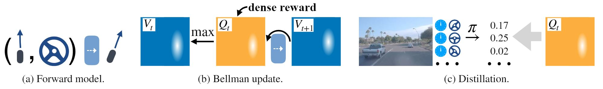

# World on Rails


> [**Learning to drive from a world on rails**](https://dotchen.github.io/world_on_rails/)    
> Dian Chen, Vladlen Koltun, Philipp Kr&auml;henb&uuml;hl,        
> _arXiv techical report ([arXiv 2105.00636](https://arxiv.org/abs/2105.00636))_

[](https://paperswithcode.com/sota/autonomous-driving-on-carla-leaderboard?p=learning-to-drive-from-a-world-on-rails)

This repo contains code for our paper [Learning to drive from a world on rails](https://arxiv.org/abs/2105.00636).

ProcGen code coming soon.

## Reference
If you find our repo or paper useful, please cite us as
```bibtex
@inproceedings{chen2021learning,
  title={Learning to drive from a world on rails},
  author={Chen, Dian and Koltun, Vladlen and Kr{\"a}henb{\"u}hl, Philipp},
  booktitle={ICCV},
  year={2021}
}
```

## Updates
* We have released the pre-computed Q values in our dataset! Check [DATASET.md](docs/DATASET.md) for details.
* Checkout our [website](https://dotchen.github.io/world_on_rails/) for demo videos!

## Getting Started
* To run CARLA and train the models, make sure you are using a machine with **at least** a mid-end GPU.
* Please follow [INSTALL.md](docs/INSTALL.md) to setup the environment.

## Training

* Please refer to [RAILS.md](docs/RAILS.md) on how to train our _World-on-Rails_ agent.
* Please refer to [LBC.md](docs/LBC.md) on how to train the _LBC_ agent.

## Evaluation

**If you evaluating the pretrained weights, make sure you are launching CARLA with `-vulkan`!**

### Leaderboard routes
```bash
python evaluate.py --agent-config=[PATH TO CONFIG]
```

### NoCrash routes
```bash
python evaluate_nocrash.py --town={Town01,Town02} --weather={train, test} --agent-config=[PATH TO CONFIG] --resume
```
* Use defaults for _RAILS_, and `--agent=autoagents/lbc_agent` for _LBC_.
* To print a readable table, use 
```bash
python -m scripts.view_nocrash_results [PATH TO CONFIG.YAML]
```

### Pretrained weights
* [Leaderboard models](https://utexas.box.com/s/8lcl7istkr23dtjqqiyu0v8is7ha5u2r)
* [NoCrash models](https://utexas.box.com/s/54m24gz5xwy1oagsqmgosch7pq561h2e)

## Dataset
We also release the data we trained for the leaderboard. 
Checkout [DATASET.md](docs/DATASET.md) for more details.

## Acknowledgements
The `leaderboard` codes are built from the original [leaderboard](https://github.com/carla-simulator/leaderboard.git) repo.
The `scenariorunner` codes are from the original [scenario_runner](https://github.com/carla-simulator/scenario_runner.git) repo.
The `waypointer.py` GPS coordinate conversion codes are build from Marin Toromanoff's leadeboard submission.

## License
This repo is released under the MIT License (please refer to the LICENSE file for details). The [leaderboard](https://github.com/carla-simulator/leaderboard.git) repo which our `leaderboard` folder builds upon is under the MIT License. 
