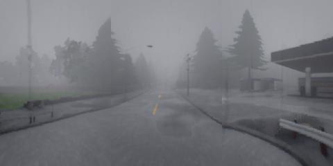
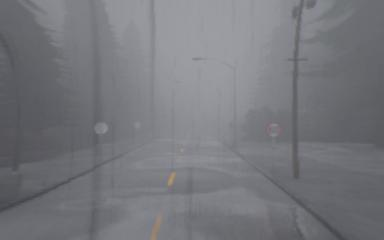
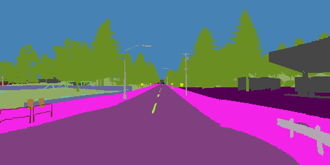
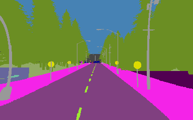

# Rails Dataset

We release the dataset with which we trained our leaderboard submission. 
This dataset is converted from the original `lmdb` format.

If you find our dataset to be useful, please cite us as
```
@inproceedings{chen2021learning,
  title={Learning to drive from a world on rails},
  author={Chen, Dian and Koltun, Vladlen and Kr{\"a}henb{\"u}hl, Philipp},
  booktitle={ICCV},
  year={2021}
}
```

## Download
[Download here](https://utexas.box.com/s/vuf439jafqvi8u4rc37sdx9xvbrn59z2)

## Images and labels
The dataset consists of 1M simulator frames. 
Each frame contains the corresponding location, rotation, speed, the surrounding map, as well as three camera suite readings.
The images and semantic segmentation labels are stored in the `rgbs` folder of each trajectory folder.

### Ego sensors
Locations, rotations, speeds, and the high-level navigation commands, and paths to sensor readings are stored 
in the `data.json` file inside each trajectory folder.

### Images

* `wide_{d}_{:05d}.jpg` is the RGB image stitched from three frontal cameras with FOV of 60.



* `narr_{d}_{:05d}.jpg` is the RGB image from the frontal cameras with FOV of 50.



### Semantic labels
The semantic segmentation labeled are stored as palette PNG files. 
Refer to this [doc](https://carla.readthedocs.io/en/latest/ref_sensors/#semantic-segmentation-camera) for reference.
* `wide_sem_{d}_{:05d}.png` is the corresponding semantic segmentation labels to `wide_{d}_{:05d}.jpg`



* `narr_sem_{d}_{:05d}.png` is the corresponding semantic segmentation labels to `narr_{d}_{:05d}.jpg`



### Map
The maps are stored as per channel PNG files as
```bash
lbl_{d}_{:05d}.png
```
where `{d}` is the channel number. If corresponds to 

```
0: road mask
1: lane boundary mask
2: stop sign trigger box
3: vehicle
4: pedestrian
5: red light trigger box
6+:lane centers
```

### Labeled Actions
The pre-labeled Q values are stoded in `data.json` files as a flattened list.
Its original shape is `num_cmds x num_actions x num_speeds`.

### FAQ
**Q**: Why are the images distorted?

**A**: Because leaderboard assumes lens distortion.

## License
This dataset is released under the CC-BY license. 

CARLA itself is under MIT license and its assets are under CC-BY license.
