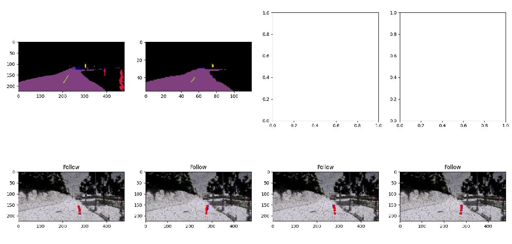

# Training LBC

This page provides instructions to train a [LBC](https://arxiv.org/abs/1912.12294) model. 

If you find this to be useful, please also cite:

```
@inproceedings{chen2019lbc,
  author    = {Chen, Dian and Zhou, Brady and Koltun, Vladlen and Kr\"ahenb\"uhl, Philipp},
  title     = {Learning by Cheating},
  booktitle = {Conference on Robot Learning (CoRL)},
  year      = {2019},
}
```

**Note**: for each stage, you can use wandb to visualize and monitor the progress.

## Setup
Create the following `config_lbc.yaml` file.
```yaml
---
num_plan: 5
camera_x: 1.5
camera_z: 2.4
camera_yaws: [0,-30,30]
seg_channels: [4,6,7,10,18]
seg_weight: 0.05
imagenet_pretrained: True
log_wandb: True
noise_collect: False
x_jitter: 3
a_jitter: 15
crop_top: 8
crop_bottom: 8
bev_model_dir: [PATH TO PRIVILEGED MODELS]
rgb_model_dir: [PATH TO PHASE MODELS]
main_data_dir: [PATH TO DATA]
```

## Data collection
Pleaes refer to [RAILS.md](RAILS.md) for instructions on data collection.

## Stage 1: privileged BEV model
* Train the model
```
python lbc.train_phase0 --save-path=[PATH TO SAVE BEV MODEL]
```

* Edit `config_lbc.yaml`
```yaml
bev_model_dir: [PATH TO SAVE BEV MODEL]
```

## Stage 2: distilled RGB model
* Train the model
```
python lbc.train_phase1 
```
* Edit `config_lbc.yaml`
```yaml
bev_model_dir: [PATH TO RGB MODEL]
```

