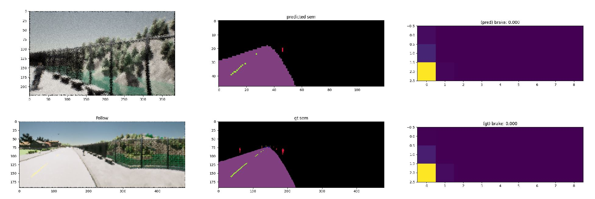

#  Training World on Rails

**Note**: for each stage, you can use wandb to visualize and monitor the progress.

## Stage 0: ego model

You may skip this step, and directly use the pretrained `ego_model.th` in this repo if you want to.

### Data collection
* Edit [config.yaml](../config.yaml) and specify the path to store ego model data
```yaml
ego_data_dir: [PATH TO PHASE 0 DATA]
```
* Launch CARLA servers
```
./scripts/launch_carla.sh [NUM RUNNERS] [WORLD PORT]
```
* Launch data collection workers
```bash
python -m rails.data_phase0 --num-runners=[NUM RUNNERS] --port=[WORLD PORT]
```

### Train ego model
* Train the ego dynamics model
```bash
python -m rails.train_phase0 --save-dir=[EGO MODEL DIR]
```
* Edit [config.yaml](../config.yaml) and specify the path to the trained ego model weights
```yaml
ego_model_dir: [EGO MODEL DIR]
```
## Stage 1: Q-computation

**Note**: This stage will take **a lot of time** if you do not paralleize with multiple GPUs.

### Data collection
* Specify the path you would like to store the dataset in [config.yaml](../config.yaml)
* Launch CARLA servers
```
./scripts/launch_carla.sh [NUM RUNNERS] [WORLD PORT]
```
* Pick the setting you would like to collect data in.  
```bash
python -m rails.data_phase1 --scenario={train_scenario, nocrash_train_scenario} --num-runners=[NUM RUNNERS] --port=[WORLD PORT]
```
`train_scenario` will collect data for the leaderboard. 
You can specify the `route*.xml` you would like to collect data with in `rails/data_phase1.py`.
`nocrash_train_scenario` will collect data on Town01 with 4 training weathers.

* Q labeling
```bash
python -m rails.data_phase2 --num-runners=[NUM RUNNERS]
```

### Stage 2: Image model training
```bash
python -m rails.train_phase2
```

